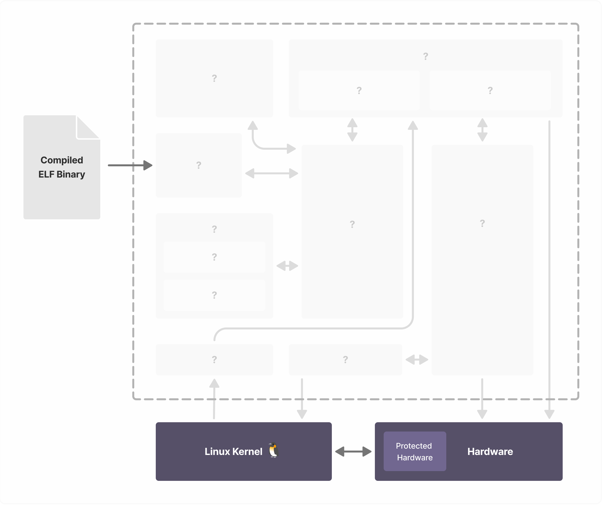

# Exercise 2: How MAMBO Works

This exercise will go through how a program like our `simple_program` is executed using MAMBO, step-by-step. It's not _necessary_ content for the rest of the tutorial, but it'll certainly help you fully grasp MAMBO if you want to contribute the project.

This exercise will obfuscate for the sake of simplicity much of how MAMBO works, most notably branch optimisations.

Feel free to come back to this exercise later and go straight to [Exercise 3 (TODO)](../README.md) if you want to get to the programming, this exercise is just reading material. If not, let's continue.

---

## MAMBO, explained

An abstract layout of MAMBO's architecture is shown below, with MAMBO wrapped inside the dotted area:

 

A **very** abstract layout. For this exercise we will be going through this architecture, uncovering each component as a compiled binary like `simple_program`  is executed through MAMBO.

Before we start, it's important to point out that the architecture diagram shows the kernel as a separate entity, as both  MAMBO and the target program are entirely within **userspace** and not **kernelspace**, which brings some considerations for later in the exercise.

### ELF File

The first component that we uncover is the input for MAMBO: a compiled ELF Binary. Since MAMBO is a *dynamic* modification framework, it is also compatible with JIT Compiled languages such as Java.

 

If no plugins are enabled, this ELF Binary will appear to run as if it is normally executing on the hardware. As previously mentioned, this is known as **transparency**.

There are different levels of transparency, but it is generally understood as code being prevented from being modified in a way that changes observed native execution. However, it is unpractical that a DBM will achieve timing transparency due to overheads incurred.

### ELF Loader

The first stage for the compiled ELF binary in MAMBO is the ELF Loader where the program is loaded into memory.

 

For simplicity, portability, and full control over execution, DBM Frameworks often **load target programs within their own address space**. This cannot be done with `ld`, shown on the LHS of the diagram below, so we must implement a userspace loader which for MAMBO is `libelf`. Not to be confused with the Linux [libelf](https://archlinux.org/packages/core/x86_64/libelf/).

 

Using the userspace loader `libelf`, the ELF header of the target program is parsed and the program is loaded within MAMBO's virtual address space, shown on the RHS of the diagram above. Here, the address space of the target program including the stack frame and variables are initialised.

The target program `.text` will not be run from this region, it is instead read and copied into a region within MAMBO called the code cache.

### Code Scanner & Encoder/Decoder

With the target program loaded into memory, the next stage is for the program's instructions to be scanned line by line using a code scanner. Then, for encoding and decoding instructions, we use the program `PIE`.

 

Starting at the entry point for the program, an instruction set architecture (ISA) specific scanner will read the program in units called **basic blocks**, single entry and single branch exit blocks of code. Basic blocks end with branch instructions to other lines of code, as once a branching instruction is reached, the scanner halts and the basic block is formed.

As each line is scanned, it is sent to the decoder to be parsed. The operation of each instruction is required by MAMBO as many instructions have to be modified due to the program running within MAMBO, and not natively. These instructions include:
- Branching Instructions
- Program Counter relative instructions
- System register access
- Syscalls

If modifications are required to due to one or more of the reasons listed above, the assembly code is modified and then sent to the encoder to apply changes. This method is known as **Copy & Annotate**, opposed to **Disassemble & Resynthesise** which instead converts the assembly into an intermediate representation.

The image above shows a basic block being scanned in. In this example, the scanner has started at Line 13: `STR X3, [X5]`. Since this isn't a branch instruction, the scanner continues. Line 14 is an `ADD` instruction, so the scanner continues again. 

Whilst Line 15 isn't a branching statement, it is a syscall and as previously stated syscalls fall into the category of instructions that have to be modified before they can be executed in MAMBO. 

After this is done, the scanner continues until it reaches the `BGT` (Branch if greater than) instruction on Line 17, at which point the basic block is completed. 

Once a basic block is fully scanned and/or modified, it is sent to a memory region in MAMBO called the code cache, and control is given to the dispatcher.

> [!NOTE] 
> In reality, there are optimisations not described, such as traces (aka. Superblocks) where hot paths of code are linked together to reduce costs.

> [!IMPORTANT]
>A vital concept is that the program is **not** executed yet, but read into the code cache. A basic block is only ever **scanned once**, but may be **executed multiple times**.

### Code Cache & Dispatcher

#### Code Cache

The code cache is a region of memory that stores *basic blocks* of code from the target program like the one just shown. It is in this region that code is executed from, rather than the `.text` segment as would be typical.

Segmenting and relocating code into this cache brings some considerations:
1. Branching addresses will still reference regions the `.text` segment, and not the code cache
2. A mechanism is required for scanning and loading unloaded blocks into the code cache on demand. 

Both of these issues are handled by the dispatcher.

#### Dispatcher

The dispatcher can be thought of as the overseer of the MAMBO process. It is responsible for facilitating the execution of the target program within MAMBO by directing the program flow through a lookup table (LUT), managing context switches (Context Switcher), and implementing optimisations.

It's easiest to explain the code cache and dispatcher by going through the process of a basic block being scanned and executed.

---

 

The diagram above demonstrates the flow of MAMBO that will happen until the target program is finished executing.

Once a basic block is scanned and modified **(1)**, the original address of the entry instruction of the basic (as it is in the `.text` section) is mapped into a new location within the code cache using the hash table *Basic Block LUT* **(2)**. It is then placed in this location within the code cache to be executed. 

> [!TIP]
> We refer to this mapping as BB → TBB (Basic Block → Translated Basic Block).

With this block of the target program finally ready to be executed on the hardware, the CPU registers must firstly be changed from the context of MAMBO to the context of the target program. The **Context Switcher** within the dispatcher pushes the register set of MAMBO to the stack, and pops the target program register set to the CPU. 

Now the program can jump to the TBB address **(3)** of the current basic block and execute until the end of the block. Most basic blocks block ends with a single branching instruction. It is here that we run into the issues described in the Code Cache section: instructions pointing (directly or indirectly) to the old `.text` segment, and how we go about dynamically loading new basic blocks.

What wasn't mentioned was that these issues have already been been handled during scanning:

 

As the basic block was scanned and modified, the branch instructions at the end of the block is replaced with a trampoline to the LUT **(4)**. With the original target address stored in registers, the dispatcher will see if there is a mapping of the target BB->TBB in the LUT. If the block has been scanned already, the mapping will provide the address of the next basic block and the program will continue **(5a)**.

If the LUT returns us a miss, meaning that the next required basic block hasn't been loaded into the code cache yet, so the program changes register contexts back to MAMBO **(5b)** and jumps to the scanner to repeat the process as we have before **(6)**. 

This cycle repeats until the end of the program, or kernel interaction occurs.

### Signal Handler and Syscall Interceptor

Throughout normal execution, the target program may prompt communication with the kernel through syscalls, or the kernel may send a signal to the program. However, because the program is running inside MAMBO, a Signal Handler and a Syscall Interceptor are required to handle complications that come with not running the program natively, such as stack unwinding and thread creation/destruction.

 

Not mentioned earlier is exactly how syscalls are handled in MAMBO. Just like branch instructions, new code is instrumented in place of the syscall:

 

The syscall instruction on Line 15 from the previous example is replaced with instructions to save state, and a branch to the MAMBO-space syscall interceptor where the syscall is handled.

## Optimisations

The previous sections neglect to mention what distinguishes MAMBO from other DBMs for RISC architectures: the variety of optimisations that can be implemented. Most optimisations are to do with the main source of overhead in DBMs: indirect branches. Description of optimisations are, however, out of the scope of this tutorial.

## Plugins

Also not discussed in the first section is the component in the top left of the architecture:

 

Through an event driven API, plugins are able to dynamically modify the code to perform tasks such as basic block, branch, and cache analysis. It is here that functionality can be instrumented into MAMBO through a Plugin API, and will be the focus of the rest of this start guide.

---

In the next section, we will demonstrate how to build a plugin in MAMBO to instrument code into our `basic_program`.

[Next Section :arrow_right:](../exercise3/README.md)

