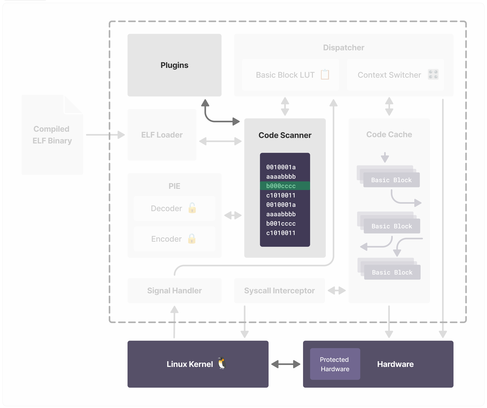

# Exercise 3: Building a Simple Plugin

This section demonstrates how to build a plugin using the in-built functions in MAMBO. 

## 3.1: Introduction to MAMBO Plugins

The Plugin API for MAMBO uses an event driven programming model where events in the code scanner trigger handlers that are written in plugin files. 

MAMBO provides functions for registering callbacks to these events. In addition, there are also helper functions built in for instrumentation, analysis, and measurement.

### 3.1.1: Callbacks and Events

Examples of runtime events include
- MAMBO generated scantime events
- Host Application runtime events
  - Syscalls
  - Block and Thread Creation & Deletion
  - Instruction specific events


Callback functions that we write for inserting code into basic blocks (instrumentation) are registered with **scantime** with *MAMBO generated scantime events* ie. when our target program is passed through the code scanner:

<div align="center">

</div>
<br>

There are several events during scantime that can have callbacks registered against them, and can be found in `/api/plugin_support.c`. The events follow the signature shown below:

```
mambo_register_<pre/post>_<event>_cb(mambo_context *ctx, mambo_callback cb)
```

So if you wanted to register a callback `my_callback()` **after** every **instruction**, you would register it like so:

```
mambo_register_post_inst_cb(ctx, my_callback)
```

By replacing the placeholders with **post** and **inst**.

If our callback includes functions to insert code alongisde target program's assembly, then it is instrumented within the scanner cache and sent to the code cache where it is executed.

### 3.1.2: Steps for Writing Plugins

> **MAMBO Context** `ctx`
> - A Global Data Structure for accessing built-in instrumentation functions
> - Provides access to variables containing the current state of MAMBO

Writing a plugin for MAMBO is simple to do thanks to the Plugin API.

1. Firstly, initialise the plugin within a constructor function
   - Within this function, you first create a reference to the MAMBO Context
   - Then, register your callback function name against a given runtime or scantime event described in **3.1.1**
2. Write your callback function
3. Add plugin filename to `dbm.c`

Now, we'll go back to `simple_program` and perform these steps to instrument some code during scantime for analysis.


---

## 3.2: Context for building a plugin

For our `simple_program`, we'll develop a plugin that measures how many times we run each basic block. Whilst the primary aim of this is to demonstrate how a plugin can be written in MAMBO, it also emphasises the difference between **scantime** and **runtime** in the MAMBO process.


Let's have a look at our simple program again:

```c
#include <stdio.h>

int main(int argc, char* argv[]) {
  int base = 2;
  int result = 1;
  for(int i = 0; i < 16; i++) {
    result *= base; 
  }
  printf("2^16 = %d\n", result);
}

```

Having gained the knowledge of how MAMBO builds and executes basic blocks, we could make a few assumptions on how the blocks are built with respect to branch statements. However, we could also look at the compiled assembly code and infer that way.

```
gcc -S -O0 simple_program.c
```
The `-S` flag compiles the C file to the assembly code shown below. Depending on your local architecture, it may look different to the ARMv8 assembly code shown below :arrow_down_small: :


```
main:
        sub     sp, sp, #48
        stp     x29, x30, [sp, #32]
        add     x29, sp, #32
        stur    wzr, [x29, #-4]
        stur    w0, [x29, #-8]
        str     x1, [sp, #16]
        mov     w8, #2
        str     w8, [sp, #12]
        mov     w8, #1
        str     w8, [sp, #8]
        str     wzr, [sp, #4]
        b       .LBB0_1
.LBB0_1:
        ldr     w8, [sp, #4]
        subs    w8, w8, #16
        b.ge    .LBB0_4
        b       .LBB0_2
.LBB0_2:
        ldr     w9, [sp, #12]
        ldr     w8, [sp, #8]
        mul     w8, w8, w9
        str     w8, [sp, #8]
        b       .LBB0_3
.LBB0_3:
        ldr     w8, [sp, #4]
        add     w8, w8, #1
        str     w8, [sp, #4]
        b       .LBB0_1
.LBB0_4:
        ldr     w1, [sp, #8]
        adrp    x0, .L.str
        add     x0, x0, :lo12:.L.str
        bl      printf
        ldur    w0, [x29, #-4]
        ldp     x29, x30, [sp, #32]
        add     sp, sp, #48
        ret

.L.str:
        .asciz  "2^16 = %d\n"
```

Going through each of the labelled sections, the assembly code performs the respective function within the flow diagram shown below:

<div align="center" >

</div>
<br>

The lighter sections within the label blocks represent a single basic block. For all but `LBB0_1`, they have one basic block as they end on a branch statement.

`LBB0_1` however has two basic blocks. This is because there are two branch statements: `b.ge    .LBB0_4` and `b       .LBB0_2`. Since a basic block is **strictly** single entry and single branch exit, `LBB0_1` will constitute as two seperate basic blocks in the code cache. 

> [!NOTE]
> The semantics of 'single branch exit' can be somewhat confusing. It simply means that in a basic block, there can only ever be a single branch instruction **and** it must be the final instruction in the block.


### The Tasks

With this context of how basic blocks are formed on our `simple_program`, our tasks for the plugin to be designed are to:
1. Prove that this is indeed how the basic blocks are formed
2. Count how many times each user-generated basic block is executed

---

### 3.3: Writing the Simple Plugin

To create the plugin, we'll have to create a new file `basic_block_plugin.c`. We'll place it in the start guide directory for now, but the implemented plugins can be found in the `/plugins` directory in the root of MAMBO.

```
vim $START_GUIDE/basic_block_plugin.c
```

The boilerplate for a plugin is shown below :arrow_down:

```c
#ifdef PLUGINS_NEW

#include <assert.h>
#include <stdio.h>

#include "../plugins.h"

// Write Callback Functions here

__attribute__((constructor))
void init_tutorial() {
  mambo_context *ctx = mambo_register_plugin();
  assert(ctx != NULL);

  // Register Callbacks here
}
#endif
```

The MAMBO Specific lines are explained as such:
- The `ifdef` statement is a legacy code related instruction
- `plugins.h` provides the header files containing the functions we'll be using, including `helpers.h` and `hash_table.h` which we use for instrumentation
- Within the constructor function, we declare the MAMBO context `ctx` and assert that it exists
- The commented areas designate where we will write our code

### Registering the Callback

As described previously, there are functions which allow us to register instrumenting callbacks at specific points in scanner.  Since we're interested in when and how often individual **basic blocks** are executed, we will have to instrument code at the **start of a basic block** that increments a counter for that given block. The function will will use to register the callback within the constructor will therefore be:

```
mambo_register_pre_basic_block_cb(ctx, my_callback);
```

We could also register under the `post_basic_bock` event, since we're just counting when we enter a block.

Next, we have to create the callback.

### Creating the Callback

Sticking with what we've already written, let's call our callback `my_callback`. The callback also requires the MAMBO context as an argument:

```c
int my_callback(mambo_context *ctx){
        // This code will run at the end of every scanned basic block 
        // NOT every time the code has been executed, only SCANNED
        // For that, you will have to instrument code so it is in the code cache
}

__attribute__((constructor))
void init_tutorial() {
  mambo_context *ctx = mambo_register_plugin();
  assert(ctx != NULL); 
  
  // Pass the event handler the MAMBO Context and ADDRESS of the callback
  mambo_register_pre_basic_block_cb(ctx, &my_callback);

}
```

To test that this works, let's print something about a basic block when it is scanned. The provided function for getting the currently scanned source address (where we're up to in the scanned binary) is: 

```
void* source_addr = mambo_get_source_addr(ctx);
```

Addresses aren't very human readable values, so we use another helper function to get the values from the symbol table:

```
int get_symbol_info_by_addr(uintptr_t addr, char **sym_name, void **start_addr, char **filename);
```

Here, we have to first declare the variables and then pass in the addresses of the declared variables. Putting everything together, our callback should look like this:

```c
int my_callback(mambo_context *ctx){
  void* source_addr = mambo_get_source_addr(ctx);
  
  char *sym_name, *filename;
  void* symbol_start_addr;
  get_symbol_info_by_addr(source_addr, &sym_name, &symbol_start_addr, &filename);

  printf("%s %p\n", filename, sym_name, source_addr);
}
```

We've included also included a print statement so we can see the filename location and start address of each basic block. 

### Registering the File


In order for MAMBO to find the plugin that we've created, we'll have to tell it where it is in the makefile that we used in Exercise 1 at `MAMBO_ROOT`. We do this by adding the line '' at the top of the makefile, below the commented out plugins in `$MAMBO_ROOT/makefile`:

```c
...
#PLUGINS+=plugins/hotspot.c
#PLUGINS+=plugins/datarace/datarace.c plugins/datarace/detectors/fasttrack.c
#PLUGINS+=plugins/datarace/datarace.c plugins/datarace/detectors/djit.c
PLUGINS+=docs/tutorials/start-guide/basic_block_plugin.c

OPTS= -DDBM_LINK_UNCOND_IMM
...
```

Now, all we need to do is `make` MAMBO again and run `$MAMBO_ROOT/dbm $START_GUIDE/simple_program.c` to view our output :arrow_down_small:

```
/usr/lib/aarch64-linux-gnu/ld-linux-aarch64.so.1 0xffffba4ae000
/usr/lib/aarch64-linux-gnu/ld-linux-aarch64.so.1 0xffffba4ae000
/usr/lib/aarch64-linux-gnu/ld-linux-aarch64.so.1 0xffffba4ae000
/usr/lib/aarch64-linux-gnu/ld-linux-aarch64.so.1 0xffffba4ae000
/usr/lib/aarch64-linux-gnu/ld-linux-aarch64.so.1 0xffffba4ae000
/usr/lib/aarch64-linux-gnu/ld-linux-aarch64.so.1 0xffffba4ae000
/usr/lib/aarch64-linux-gnu/ld-linux-aarch64.so.1 0xffffba4ae000
/usr/lib/aarch64-linux-gnu/ld-linux-aarch64.so.1 0xffffba4ae000
/usr/lib/aarch64-linux-gnu/ld-linux-aarch64.so.1 0xffffba4ae000
/usr/lib/aarch64-linux-gnu/ld-linux-aarch64.so.1 0xffffba4ae000
...
We're done; exiting with status: 0
```

Not only are we seeing basic blocks that are generated by us in `simple_program`, but we're also seeing ones generated by the standard library and the loader. 

We're only interested in those created by our program, so we can filter them out based on the filename `/simple_program` and the the symbol name `main` using `strcmp`.

> [!NOTE]
> The symbol name can be NULL, and if not checked will probably cause a segmentation fault in `strcmp`

Once you've filtered the basic blocks, the output should look like this :arrow_down_small:

```
/home/ubuntu/mambo/docs/tutorials/start-guide/simple_program main 0xffffbce25754
/home/ubuntu/mambo/docs/tutorials/start-guide/simple_program main 0xffffbce25798
/home/ubuntu/mambo/docs/tutorials/start-guide/simple_program main 0xffffbce2577c
/home/ubuntu/mambo/docs/tutorials/start-guide/simple_program main 0xffffbce257a4
2^16 = 65536
/home/ubuntu/mambo/docs/tutorials/start-guide/simple_program main 0xffffbce257b4
We're done; exiting with status: 0
```

Which shows 5 basic blocks each being scanned once, each one representing each of the blocks we derived earlier. What we want to do now is count how many times each of these blocks is executed. 

For this we can't just do this from the plugin in scantime, we'll have to instrument code into the basic blocks that gets executed during runtime. 


---

### 3.4:  Instrumenting into the Basic Block

// TODO

// I'm unsure as to why there is only 5 basic blocks and not 6.
// I imagine some optimisation is going on, but I've been unable to figure it out

// The idea for this section is to implement the hash table, like in the other tutorial 

#### Instrumenting the Counter

// TODO

...


